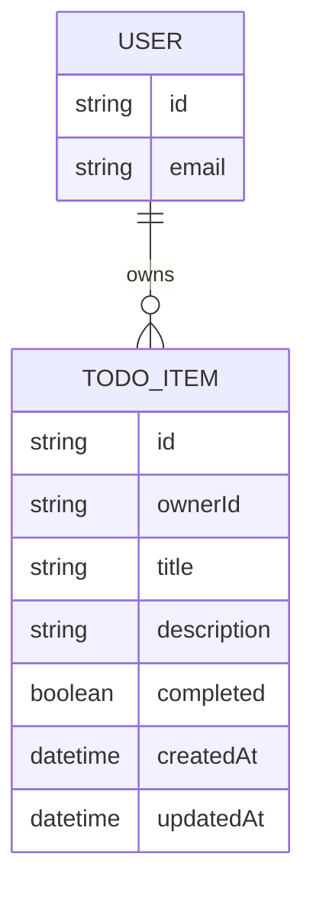

# Domain Model

The system tracks a single entity — a to-do item — always scoped to the signed-in user who owns it. The user's identity comes from Thunder; no local user profile is stored beyond the id Thunder asserts.

- **User** — identified by the `sub` claim from Thunder; not persisted by this system beyond being the owner reference on each to-do item.
- **TodoItem** — a single task: title, description, and completion status, owned by exactly one user via `ownerId`.

