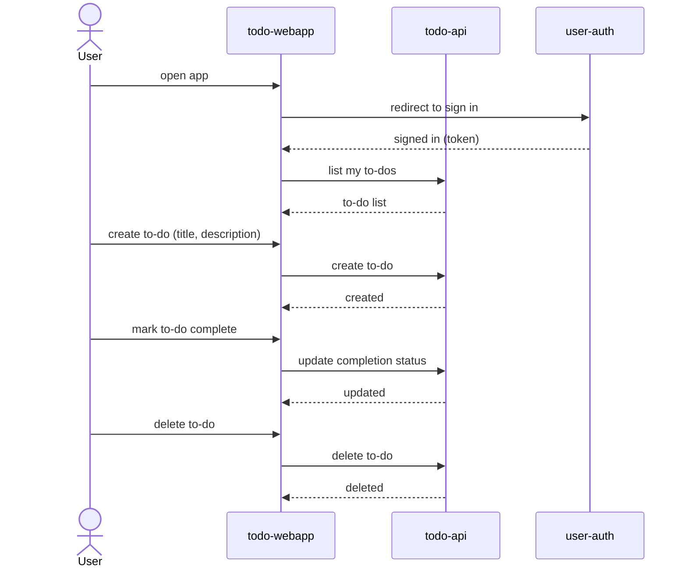

# Sign In and Manage To-Dos

A user signs in through Thunder and then creates, views, completes, and deletes their own private to-do items.

```mermaid
sequenceDiagram
    actor User
    participant todo-webapp
    participant todo-api
    participant user-auth

    User->>todo-webapp: open app
    todo-webapp->>user-auth: redirect to sign in
    user-auth-->>todo-webapp: signed in (token)
    todo-webapp->>todo-api: list my to-dos
    todo-api-->>todo-webapp: to-do list
    User->>todo-webapp: create to-do (title, description)
    todo-webapp->>todo-api: create to-do
    todo-api-->>todo-webapp: created
    User->>todo-webapp: mark to-do complete
    todo-webapp->>todo-api: update completion status
    todo-api-->>todo-webapp: updated
    User->>todo-webapp: delete to-do
    todo-webapp->>todo-api: delete to-do
    todo-api-->>todo-webapp: deleted
```

